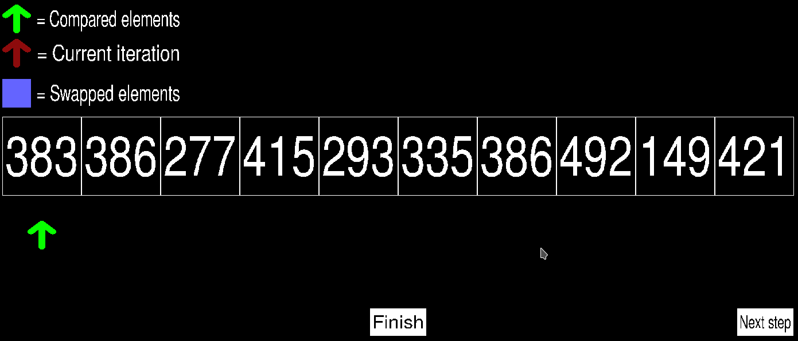

# Bubble sort visualizer
Bubble sort visualizer made in C++ with SDL2.

Visually shows which elements are checked and swapped during a bubble sort algorithm.
Buttons for easy step-by-step progression of the algorithm.

Compile using `make`.

Run using `./sorter`

Requires [SDL2](https://www.libsdl.org/) and [SDL_TTF](https://www.libsdl.org/projects/SDL_ttf/).
